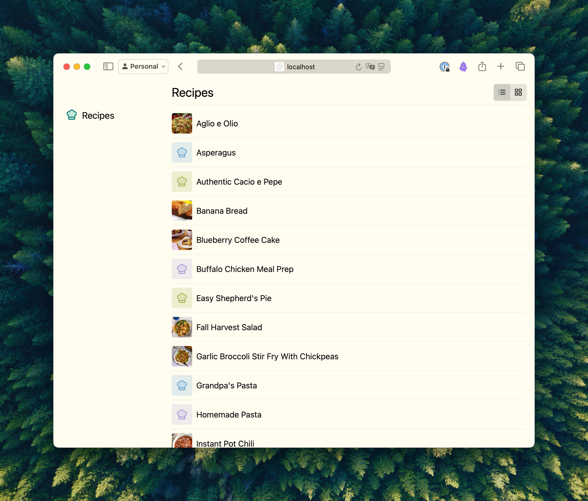
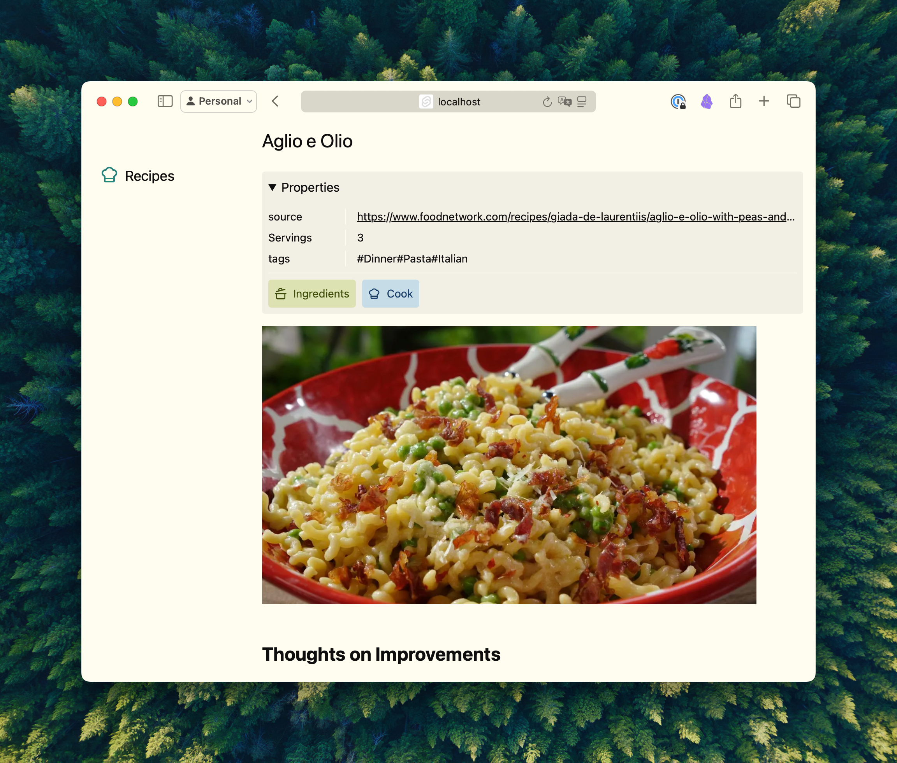
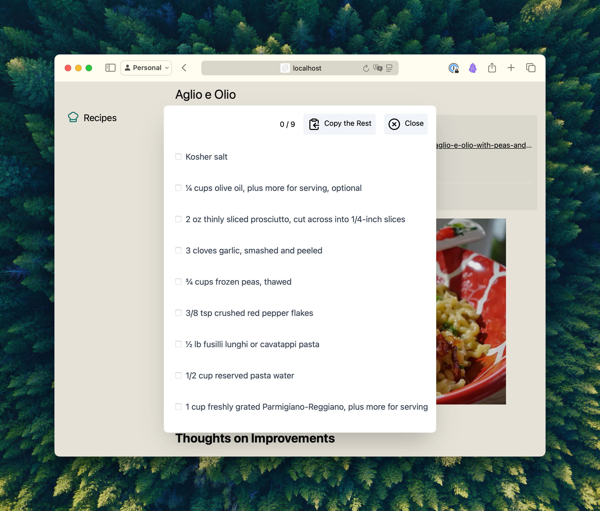
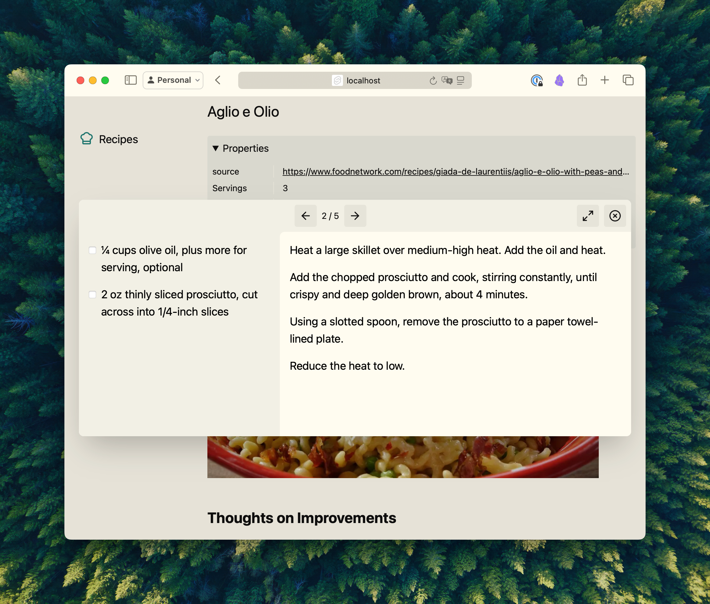

# markdown recipe app

Build a static web site from recipes in your Obsidian vault

## What is this?

I have recently been managing my recipe collection in my Obsidian vault through a plugin called [`obsidian-recipe-view`](https://github.com/lachholden/obsidian-recipe-view). I really like keeping my recipes in Markdown, but don't like having to actually be inside Obsidian while I'm cooking.

Inspired by the principle of [file over app](https://stephango.com/file-over-app), I figured I could build a custom recipe application UI on top of the data that still lives in Obsidian. This gives me a more tailored experience to how I need to _use_ my recipes without having to compromise on the way the data is stored.

## Running the app

The app automatically treats all files within the `Recipes/` directory of an Obsidian vault as recipes that it will pull into the app. "Assets" referenced by these files are rendered in the app, but files outside of that location are considered "external" and will be opened in Obsidian, instead.

The `VAULT_PATH` environment variable should point to the location of your Obsidian vault; you can set this in an `.env.local` file as a convenience.

> [!WARNING]  
> Be careful when building out the site from your Obsidian vault; there is always a risk when deploying an application from otherwise-private data

## Screenshots

